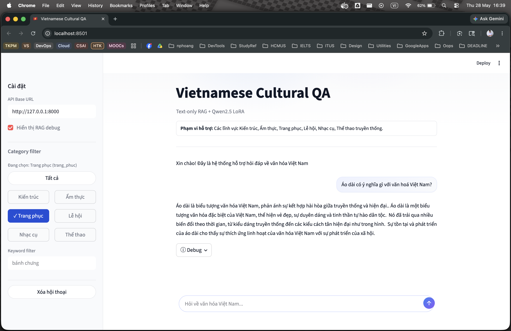
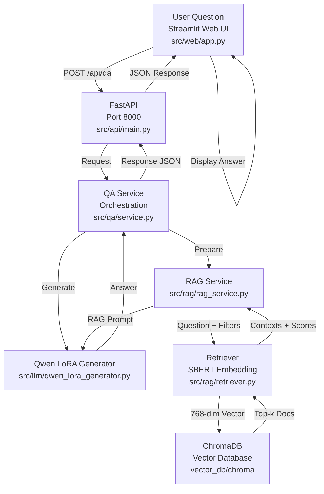

# Vietnamese Cultural QA with RAG

<div align="center">
  
</div>

<div align="center">

## [Explore the docs »](https://drive.google.com/drive/folders/1JCl41_UU0UmK7-XXDJo-MhzRRdwTVRBX?usp=drive_link)

[View Base Model](https://huggingface.co/Qwen) · [View LoRA adapter](https://huggingface.co/ohthisischichi/viet-cultural-qa-qwen2.5-lora) · [View Raw Data](https://huggingface.co/datasets/Dangindev/viet-cultural-vqa)

</div>

This repository contains a text-only Vietnamese cultural question answering system. The runtime pipeline is no longer Visual Question Answering: users provide a Vietnamese question, the system retrieves relevant cultural knowledge from ChromaDB, builds a RAG prompt, and generates an answer with Qwen2.5 plus a LoRA adapter.

The original data still comes from the `Dangindev/viet-cultural-vqa` dataset, but images and captions are now mainly used during data processing for standalone-question rewriting and traceability. The current API and web app do not accept images as runtime input.

## Tech Stack

<div align="center">

| |  |  |  |
|:---:|:---:|:---:|:---:|
|  |  |  |  |

</div>

## Objective

```text
Vietnamese question -> Retrieval query -> Cultural context -> Qwen2.5 LoRA answer
```

The system focuses on Vietnamese cultural topics such as cuisine, architecture, festivals, musical instruments, clothing, and traditional sports. For context-dependent questions such as "What is this?" or "What does this image show?", the data pipeline creates a `standalone_question` so the question can be used independently for retrieval and evaluation.

## Main Features

- Text-only Vietnamese Cultural QA.
- RAG retrieval with Vietnamese SBERT and ChromaDB.
- JSONL knowledge base with `keyword`, `category`, and `subcategory` metadata.
- Answer generation with `Qwen/Qwen2.5-3B-Instruct` and LoRA adapter `ohthisischichi/viet-cultural-qa-qwen2.5-lora`.
- FastAPI endpoints, including a streaming endpoint.
- Streamlit chat UI backed by the FastAPI service.
- CLI demo for local QA.
- Retrieval evaluation with hit@k, MRR, top-1 score/distance, and error analysis.

## Data Categories

Valid categories in the current code:

| Category | Meaning |
| --- | --- |
| `am_thuc` | Cuisine |
| `kien_truc` | Architecture |
| `le_hoi` | Festivals |
| `nhac_cu` | Musical instruments |
| `the_thao_truyen_thong` | Traditional sports |
| `trang_phuc` | Clothing |

## Current Architecture



Important runtime modules:

- `src/api/main.py`: FastAPI app.
- `src/web/app.py`: Streamlit chat UI.
- `src/qa/service.py`: end-to-end QA orchestration.
- `src/rag/rag_service.py`: retrieval query, filters, context, and prompt preparation.
- `src/rag/retriever.py`: embedding and Chroma retrieval.
- `src/llm/qwen_lora_generator.py`: Qwen2.5 base model plus LoRA generation.

## Data And Schema

Processed QA records:

```text
data/processed/final_train.jsonl
data/processed/final_val.jsonl
data/processed/final_test.jsonl
```

Important fields:

```json
{
  "image_id": "...",
  "base_image_id": "...",
  "question_id": "q1",
  "category": "am_thuc",
  "subcategory": "banh_chung_Tet",
  "keyword": "bánh chưng",
  "question": "Đây là gì?",
  "standalone_question": "Bánh chưng là gì?",
  "cultural_context": "...",
  "answer_label": "..."
}
```

RAG knowledge base:

```text
data/knowledge/knowledge_base.jsonl
```

Knowledge document schema:

```json
{
  "schema_version": "1.0",
  "doc_id": "am_thuc|banh_chung|43a168a817ca",
  "content": "Chủ đề: bánh chưng\nDanh mục: am_thuc\nNgữ cảnh văn hóa: ...",
  "metadata": {
    "keyword": "bánh chưng",
    "category": "am_thuc",
    "subcategory": "banh_chung",
    "base_image_id": "...",
    "source_image_ids": ["..."],
    "source_count": 5
  }
}
```

## Installation

```bash
python -m venv .venv
source .venv/bin/activate
pip install --upgrade pip
pip install -r requirements.txt
```

On Windows PowerShell:

```powershell
python -m venv .venv
.venv\Scripts\Activate.ps1
pip install --upgrade pip
pip install -r requirements.txt
```

If you want to use Gemini as the optional fallback for standalone-question rewriting, create a `.env` file:

```bash
cp .env.example .env
```

and set:

```text
GEMINI_API_KEY=...
```

This key is only needed for the Gemini rewrite fallback. The QA runtime uses Hugging Face models configured in `configs/rag.yaml`.

## Configuration

Main config files:

```text
configs/rag.yaml
configs/preprocessing.yaml
configs/keyword_normalization.yaml
```

`configs/rag.yaml` controls:

- Knowledge base input path.
- Chroma persist directory and collection name.
- Embedding model, default `keepitreal/vietnamese-sbert`.
- Retrieval `top_k` and optional score threshold.
- Inference context limit and optional metadata filters.
- Generation model, default `Qwen/Qwen2.5-3B-Instruct` plus LoRA adapter.

## Data Pipeline

### 1. Build standalone questions

This script reads a raw split, validates `image_id`, rewrites each question into `standalone_question`, and writes processed JSONL plus stats.

```bash
python scripts/build/build_standalone_questions.py \
  --input data/raw/train.jsonl \
  --output data/processed/final_train.jsonl \
  --stats-output data/stats/train_standalone_stats.json \
  --pending-output data/cache/pending_train_llm.jsonl
```

Run the same command pattern for `val.jsonl` and `test.jsonl`.

To enable Gemini fallback:

```bash
python scripts/build/build_standalone_questions.py \
  --input data/raw/train.jsonl \
  --output data/processed/final_train.jsonl \
  --stats-output data/stats/train_standalone_stats.json \
  --pending-output data/cache/pending_train_llm.jsonl \
  --use-llm
```

### 2. Validate the knowledge base

```bash
python scripts/evaluation/validate_knowledge_base.py \
  --input data/knowledge/knowledge_base.jsonl \
  --valid-output data/knowledge/knowledge_base.validated.jsonl \
  --stats-output data/stats/knowledge_base_validation_stats.json
```

### 3. Build the Chroma vector database

The vector DB should be built from the validated knowledge base:

```bash
python scripts/build/build_vector_db.py \
  --config configs/rag.yaml \
  --input data/knowledge/knowledge_base.validated.jsonl \
  --stats-output data/stats/knowledge_base_stats.json \
  --recreate
```

Default vector DB location:

```text
vector_db/chroma
```

## Running QA

### CLI demo

```bash
python scripts/demos/run_text_qa_demo.py \
  --question "Bánh chưng có ý nghĩa gì trong ngày Tết?" \
  --show-context
```

Optional manual filters:

```bash
python scripts/demos/run_text_qa_demo.py \
  --question "Bánh chưng có ý nghĩa gì trong ngày Tết?" \
  --category am_thuc \
  --keyword "bánh chưng" \
  --show-context \
  --show-prompt
```

### FastAPI

```bash
uvicorn src.api.main:app --host 127.0.0.1 --port 8000
```

Health check:

```bash
curl http://127.0.0.1:8000/health
```

Non-streaming QA:

```bash
curl -X POST http://127.0.0.1:8000/api/qa \
  -H "Content-Type: application/json" \
  -d '{
    "question": "Bánh chưng có ý nghĩa gì trong ngày Tết?",
    "category": "am_thuc",
    "debug": true
  }'
```

API request schema:

```json
{
  "question": "...",
  "normalized_question": null,
  "category": null,
  "keyword": null,
  "debug": true
}
```

The API response includes `answer`, `retrieval_query`, timing, filters, retrieved contexts, and the final prompt when `debug=true`.

### Streamlit UI

The Streamlit UI calls the API at `http://127.0.0.1:8000`, so start FastAPI first, then run:

```bash
streamlit run src/web/app.py
```

The current UI is a text-only chat interface with sidebar controls for debug mode and optional category/keyword filters.

## Retrieval Evaluation

The knowledge base is primarily built from the train split, so retrieval evaluation should mainly use val/test. Train is only used for sanity checking.

### Build eval queries

```bash
python scripts/evaluation/build_retrieval_eval_queries.py
```

Default outputs:

```text
data/rag-evaluation/retrieval_eval_train_sanity.jsonl
data/rag-evaluation/retrieval_eval_val.jsonl
data/rag-evaluation/retrieval_eval_test.jsonl
data/rag-evaluation/retrieval_eval_queries.jsonl
```

Each item uses this schema:

```json
{
  "id": "...",
  "question": "...",
  "normalized_question": "...",
  "expected_keyword": "...",
  "expected_category": "...",
  "expected_subcategory": "...",
  "source_split": "val"
}
```

### Evaluate retrieval

```bash
python scripts/evaluation/evaluate_retrieval.py \
  --input data/rag-evaluation/retrieval_eval_queries.jsonl \
  --output-results data/rag-evaluation/results/retrieval_eval_results.jsonl \
  --output-summary data/rag-evaluation/results/retrieval_eval_summary.json \
  --top-k 5
```

With category filtering:

```bash
python scripts/evaluation/evaluate_retrieval.py \
  --input data/rag-evaluation/retrieval_eval_queries.jsonl \
  --output-results data/rag-evaluation/results/retrieval_eval_results.category_filter.jsonl \
  --output-summary data/rag-evaluation/results/retrieval_eval_summary.category_filter.json \
  --top-k 5 \
  --use-category-filter
```

Main metrics:

- `top1_keyword_accuracy`
- `topk_keyword_accuracy`
- `top1_category_accuracy`
- `topk_category_accuracy`
- `mrr_keyword`
- `mrr_category`
- `avg_top1_score`
- `avg_top1_distance`

### Error analysis

Export keyword misses:

```bash
python scripts/evaluation/export_retrieval_keyword_misses.py \
  --input data/rag-evaluation/results/retrieval_eval_results.category_filter.jsonl \
  --output data/rag-evaluation/results/retrieval_eval_keyword_misses.category_filter.jsonl
```

Build top-10 representative error analysis:

```bash
python scripts/evaluation/export_retrieval_keyword_misses.py \
  --input data/rag-evaluation/results/retrieval_eval_results.category_filter.top10.jsonl \
  --output data/rag-evaluation/results/retrieval_eval_keyword_misses.category_filter.top10.jsonl \
  --top-n 10

python scripts/evaluation/build_retrieval_error_analysis.py \
  --input data/rag-evaluation/results/retrieval_eval_keyword_misses.category_filter.top10.jsonl \
  --num-cases 30 \
  --top-n 20
```

## Smoke Tests

Available smoke tests:

```bash
python scripts/smoke_tests/test_embedding.py
python scripts/smoke_tests/test_document_normalization.py
python scripts/smoke_tests/test_vector_store.py
python scripts/smoke_tests/test_rag_inference.py
python scripts/smoke_tests/test_qa_service.py
```

`test_qa_service.py` loads both the retriever and the Qwen LoRA generator, so it needs model weights, the vector DB, and enough RAM/VRAM/MPS/GPU memory.

## Project Structure

```text
.
├── configs/
│   ├── preprocessing.yaml
│   ├── rag.yaml
│   └── keyword_normalization.yaml
├── data/
│   ├── raw/
│   ├── processed/
│   ├── knowledge/
│   ├── stats/
│   └── rag-evaluation/
├── scripts/
│   ├── build/
│   │   ├── build_standalone_questions.py
│   │   ├── build_vector_db.py
│   │   └── build_test_retrieve_context.py
│   ├── demos/
│   │   └── run_text_qa_demo.py
│   ├── evaluation/
│   │   ├── build_retrieval_eval_queries.py
│   │   ├── evaluate_retrieval.py
│   │   ├── export_retrieval_keyword_misses.py
│   │   ├── build_retrieval_error_analysis.py
│   │   └── generate_rag_report.py
│   ├── maintenance/
│   │   ├── clean_keywords.py
│   │   └── validate_knowledge_base.py
│   └── smoke_tests/
├── src/
│   ├── api/
│   ├── qa/
│   ├── rag/
│   ├── llm/
│   ├── standalone/
│   ├── utils/
│   └── web/
├── vector_db/
│   └── chroma/
├── notebooks/
├── tests/
├── requirements.txt
└── README.md
```

## Important Notes

- Runtime is currently text-only QA, not image VQA.
- Image-related fields such as `image_id`, `image_path`, and `vision_caption` remain in processed data because the original dataset is VQA and those fields are useful for rewriting and traceability.
- RAG retrieval should use `standalone_question` or `normalized_question` when available, with fallback to `question`.
- If the knowledge base is built from train, val/test rows whose keywords do not exist in the KB should be filtered before retrieval evaluation.
- The first run may download models from Hugging Face: the embedding model, Qwen base model, and LoRA adapter.
- Run FastAPI and Streamlit in separate terminals when using the web UI.

## License

This project is for academic and research use. The dataset follows the license provided by the original dataset maintainers on Hugging Face.
