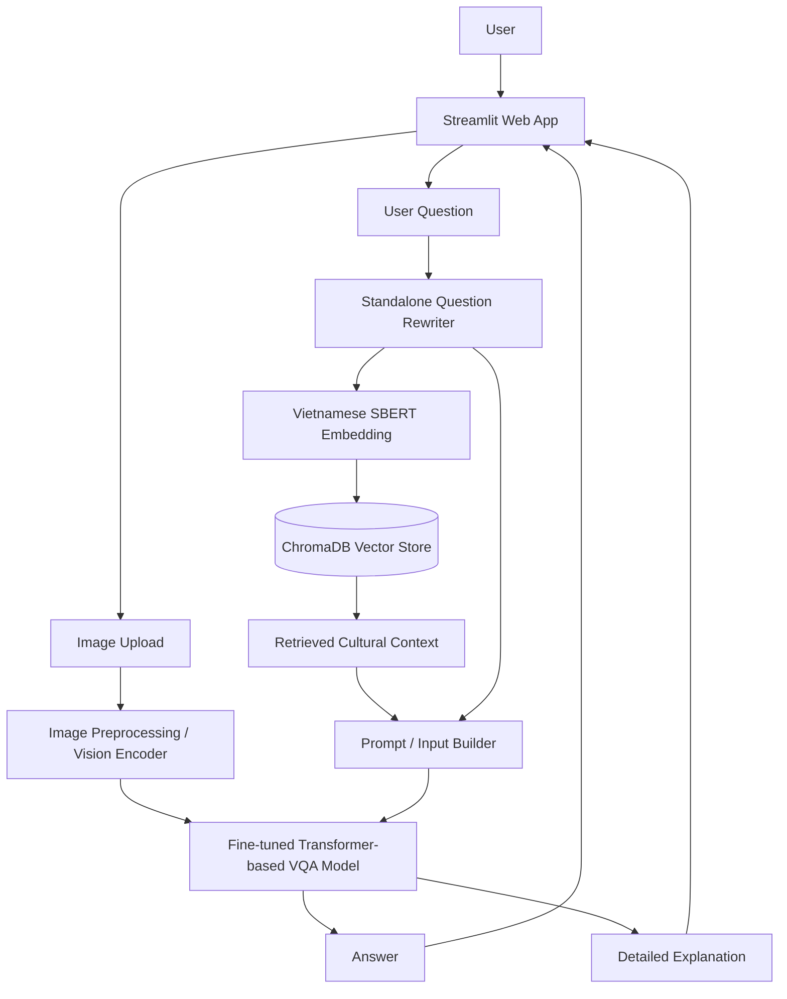
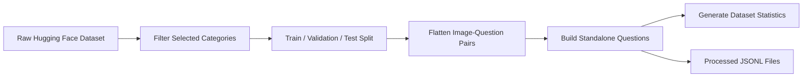
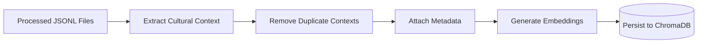
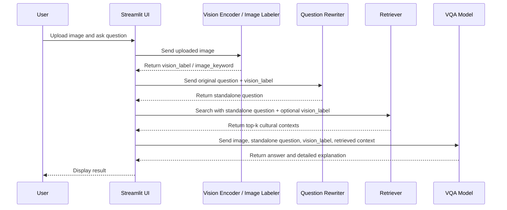
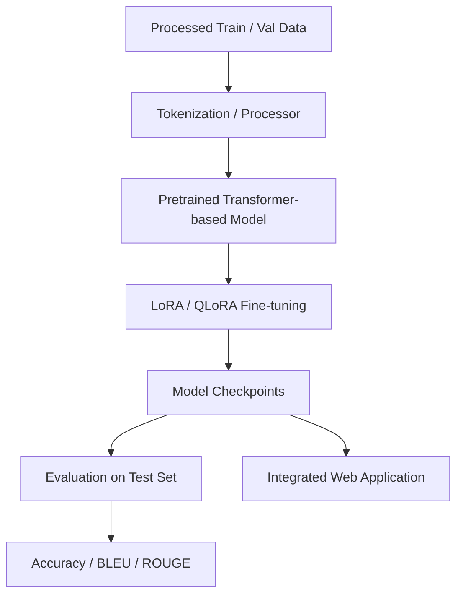

# Vietnamese Cultural Visual Question Answering (VQA)

A Transformer-based multimodal NLP application for Vietnamese Cultural Visual Question Answering. The system answers Vietnamese questions about cultural images and enriches the response with retrieved cultural knowledge using a Retrieval-Augmented Generation (RAG) pipeline.

---

## 1. Project Overview

This project builds a web-based Visual Question Answering (VQA) system for Vietnamese cultural heritage. Given an input image and a Vietnamese question, the system generates an answer and optionally provides a detailed cultural explanation.

The project uses the [`Dangindev/viet-cultural-vqa`](https://huggingface.co/datasets/Dangindev/viet-cultural-vqa) dataset, which contains Vietnamese cultural images, question-answer pairs, image analysis, cultural context, and detailed explanations.

### Main Objective

```text
Image + Question + Retrieved Cultural Context -> Answer + Detailed Explanation
```

Unlike generic VQA systems that only rely on visual features, this project adds a cultural knowledge retrieval layer. This is important because many Vietnamese cultural questions require background knowledge about history, region, symbolism, tradition, or modern relevance.

### Core Features

- Vietnamese Visual Question Answering over cultural images.
- Standalone question rewriting for context-dependent questions.
- Cultural knowledge retrieval using ChromaDB and Vietnamese sentence embeddings.
- Transformer-based model fine-tuning for VQA / question answering.
- Web application for image upload, question input, answer generation, and explanation display.
- Evaluation using suitable metrics such as Accuracy, BLEU, and ROUGE.

### Dataset Categories

The selected working categories may include:

- Architecture (`kien_truc`)
- Cuisine (`am_thuc`)
- Clothing (`trang_phuc`)
- Festivals (`le_hoi`)
- Music instruments (`nhac_cu`)
- Traditional sports (`the_thao_truyen_thong`)

---

## 2. Tech Stack

| Category | Tools / Libraries |
| --- | --- |
| Programming Language | Python 3.10+ |
| Data Processing | Hugging Face `datasets`, Pandas, NumPy, Pillow |
| NLP / Multimodal Modeling | Hugging Face `transformers`, PyTorch, PEFT, LoRA / QLoRA, bitsandbytes, accelerate |
| Embedding & Retrieval | Sentence Transformers, Vietnamese SBERT (for example `keepitreal/vietnamese-sbert`), ChromaDB |
| Web Application | Streamlit |
| Evaluation | scikit-learn, evaluate, sacrebleu / rouge-score |
| Experiment & Logging | TensorBoard or Weights & Biases, CSV / JSON logs for preprocessing and retrieval statistics |

---

## 3. System Architecture & Pipeline

### High-Level Architecture



### Data Preparation Pipeline



### RAG Knowledge Base Pipeline



### Inference Pipeline



### Training Pipeline



---

## 4. Project Structure

```text
vietnamese-cultural-vqa/
│
├── README.md
├── requirements.txt
├── .env.example
├── config.yaml
│
├── data/
│   ├── raw/
│   │   ├── train_data.json
│   │   ├── val_data.json
│   │   └── test_data.json
│   │
│   ├── processed/
│   │   ├── final_train.jsonl
│   │   ├── final_val.jsonl
│   │   └── final_test.jsonl
│   │
│   └── stats/
│       ├── category_distribution.csv
│       ├── split_distribution.csv
│       └── standalone_question_stats.csv
│
├── notebooks/
│   ├── 01_dataset_exploration.ipynb
│   ├── 02_standalone_question.ipynb
│   ├── 03_rag_retrieval_test.ipynb
│   └── 04_model_training.ipynb
│
├── scripts/
│   ├── download_dataset.py
│   ├── filter_categories.py
│   ├── build_standalone_questions.py
│   ├── build_vector_db.py
│   ├── train.py
│   ├── evaluate.py
│   └── run_inference.py
│
├── src/
│   ├── data/
│   │   ├── loader.py
│   │   ├── preprocessing.py
│   │   └── statistics.py
│   │
│   ├── standalone/
│   │   ├── template_rewriter.py
│   │   ├── llm_rewriter.py
│   │   └── standalone_service.py
│   │
│   ├── rag/
│   │   ├── embedding.py
│   │   ├── vector_store.py
│   │   ├── retriever.py
│   │   └── prompt_builder.py
│   │
│   ├── model/
│   │   ├── training.py
│   │   ├── inference.py
│   │   └── checkpoint_loader.py
│   │
│   ├── pipeline/
│   │   └── vqa_pipeline.py
│   │
│   └── utils/
│       ├── config.py
│       ├── logging.py
│       └── io.py
│
├── app/
│   ├── streamlit_app.py
│   ├── components.py
│   └── assets/
│
├── vector_db/
│   └── chroma/
│
├── models/
│   └── checkpoints/
│
├── reports/
│   ├── figures/
│   ├── tables/
│   └── final_report.md
│
└── tests/
    ├── test_preprocessing.py
    ├── test_retriever.py
    └── test_pipeline.py
```

---

## 5. Installation & Setup

### 5.1. Clone the Repository

```bash
git clone https://github.com/nphoang-itus/vie-cultural-vqa-sl-fithcmus.git
cd vie-cultural-vqa-sl-fithcmus
```

### 5.2. Create a Virtual Environment

```bash
python -m venv .venv
source .venv/bin/activate
```

For Windows PowerShell:

```powershell
python -m venv .venv
.venv\Scripts\Activate.ps1
```

### 5.3. Install Dependencies

```bash
pip install --upgrade pip
pip install -r requirements.txt
```

### 5.4. Configure Environment Variables

Create a `.env` file from the example file:

```bash
cp .env.example .env
```

### 5.5. Download the Dataset

```bash
python scripts/download_dataset.py \
  --dataset-name Dangindev/viet-cultural-vqa \
  --output-dir data/raw
```

Alternatively, the dataset can be loaded directly in Python:

```python
from datasets import load_dataset

train_data = load_dataset("Dangindev/viet-cultural-vqa", split="train")
val_data = load_dataset("Dangindev/viet-cultural-vqa", split="validation")
test_data = load_dataset("Dangindev/viet-cultural-vqa", split="test")
```

### 5.6. Preprocess the Data

Filter selected cultural categories and build processed JSONL files:

```bash
python scripts/filter_categories.py \
  --input-dir data/raw \
  --output-dir data/processed \
  --categories kien_truc am_thuc trang_phuc le_hoi nhac_cu the_thao_truyen_thong
```

Build standalone questions:

```bash
python scripts/build_standalone_questions.py \
  --input data/processed/train.jsonl \
  --output data/processed/final_train.jsonl \
  --stats-output data/stats/standalone_question_stats.csv
```

### 5.7. Build the Vector Database

```bash
python scripts/build_vector_db.py \
  --input data/processed/final_train.jsonl \
  --persist-dir vector_db/chroma \
  --embedding-model keepitreal/vietnamese-sbert
```

This step extracts cultural context, removes duplicate knowledge entries, generates embeddings, and stores the results in ChromaDB with metadata such as `image_id`, `category`, and `keyword`.

### 5.8. Train the Model

Run a small dry run first:

```bash
python scripts/train.py \
  --train-file data/processed/final_train.jsonl \
  --val-file data/processed/final_val.jsonl \
  --output-dir models/checkpoints \
  --max-steps 5
```

Then run full fine-tuning:

```bash
python scripts/train.py \
  --train-file data/processed/final_train.jsonl \
  --val-file data/processed/final_val.jsonl \
  --output-dir models/checkpoints \
  --num-train-epochs 3 \
  --learning-rate 2e-5 \
  --use-lora true
```

### 5.9. Evaluate the Model

```bash
python scripts/evaluate.py \
  --test-file data/processed/final_test.jsonl \
  --checkpoint-dir models/checkpoints \
  --output-dir reports/tables
```

Expected evaluation outputs:

- Accuracy for short identification answers.
- BLEU / ROUGE for long-form generated explanations.
- Retrieval quality samples for RAG debugging.

### 5.10. Run the Web Application

```bash
streamlit run app/streamlit_app.py
```

The web app should support:

- Image upload.
- Vietnamese question input.
- Answer generation.
- Detailed explanation display.
- Retrieved cultural context display.
- Optional metadata display for debugging.

---

## Notes

- The vector database should be built using the same embedding model used during retrieval.
- Cultural context entries should be deduplicated before insertion into ChromaDB.
- Metadata such as `image_id`, `category`, and `keyword` should be stored with every vector document.
- A small dry run should be executed before full GPU training to detect data format and path errors early.
- Checkpoints should be saved regularly during training to avoid losing progress.

---

## License

This project is for academic and educational purposes. The dataset follows the license provided by the original dataset maintainers on Hugging Face.
