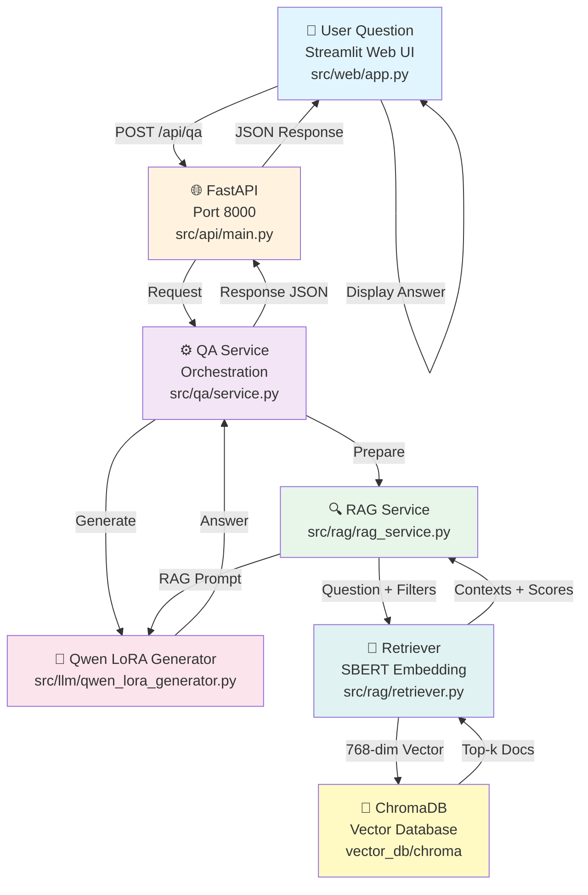
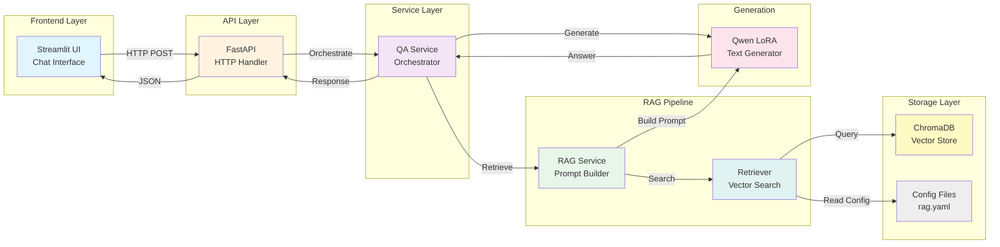

# Vietnamese Cultural QA - Complete Architecture

## System Overview

This document describes the complete end-to-end flow from user input in the web UI to response generation, covering all components, data transformations, and interactions.

### Request-Response Flow Diagram



### Component Interaction Diagram


---

## Complete Request-Response Flow

### Phase 1: User Input & Request Submission

#### Step 1.1: User Interaction (Streamlit Web UI)
- **Location:** `src/web/app.py`
- **Action:** User enters a Vietnamese question in the chat input box
- **Input:** Natural language text (e.g., "Bánh chưng là gì?")
- **Optional Parameters:**
  - `debug` mode (toggle to see retrieval context and prompt)
  - `category` filter (e.g., "am_thuc")
  - `keyword` filter (e.g., "bánh chưng")

#### Step 1.2: HTTP Request Construction
- **Streamlit** formats the request as JSON:
  ```json
  {
    "question": "Bánh chưng là gì?",
    "normalized_question": null,
    "category": null,
    "keyword": null,
    "debug": true
  }
  ```
- **HTTP Method:** POST
- **Endpoint:** `http://127.0.0.1:8000/api/qa`
- **Headers:** `Content-Type: application/json`

---

### Phase 2: API Request Handling

#### Step 2.1: Request Arrives at FastAPI
- **Location:** `src/api/main.py` → `/api/qa` endpoint
- **Framework:** FastAPI (async endpoint)
- **Processing:**
  - Request is deserialized into a Pydantic model
  - Validation occurs (question must not be empty)
  - Request ID or timestamp is optionally logged

#### Step 2.2: Delegate to QA Service
- **Call:** `QAService.generate_answer(request)`
- **Location:** `src/qa/service.py` → `QAService` class
- **Responsibility:** Orchestrates the entire QA pipeline

---

### Phase 3: Question Processing & RAG Retrieval

#### Step 3.1: Initialize RAG Pipeline
- **Location:** `src/qa/service.py` → `QAService.generate_answer()`
- **Step:**
  1. Instantiate `RagService` with loaded config from `configs/rag.yaml`
  2. Load ChromaDB collection (persisted at `vector_db/chroma/`)
  3. Initialize Vietnamese SBERT embedding model (`keepitreal/vietnamese-sbert`)

#### Step 3.2: Prepare Retrieval Query
- **Location:** `src/rag/rag_service.py` → `RagService.prepare_context()`
- **Input:** User's question + optional filters (category, keyword)
- **Process:**
  1. **Normalize Question (if needed):**
     - If `normalized_question` not provided, use `question` as-is
     - Apply light text normalization (lowercase, strip whitespace)
  
  2. **Select Retrieval Query:**
     - Prioritize: `normalized_question` > `standalone_question` > `question`
     - For example: "Bánh chưng là gì?" → retrieval query
  
  3. **Prepare Metadata Filters:**
     - If `category` provided → add to filter: `{"category": "am_thuc"}`
     - If `keyword` provided → add to filter: `{"keyword": "bánh chưng"}`
     - ChromaDB where_filter example: `{"$and": [{"category": {"$eq": "am_thuc"}}]}`

#### Step 3.3: Embedding & Vector Search
- **Location:** `src/rag/retriever.py` → `Retriever.retrieve()`
- **Steps:**
  1. **Convert Question to Embedding:**
     - Load SBERT model from Hugging Face (cached locally)
     - Pass retrieval query through embedding model
     - Output: 768-dimensional vector (Vietnamese SBERT default)
  
  2. **Query ChromaDB:**
     - Search with `top_k=5` (configurable in `rag.yaml`)
     - Optional score threshold filter
     - Apply metadata filters (category, keyword)
     - Request both distance/score and full documents
  
  3. **ChromaDB Response:**
     - Returns top-5 documents by cosine similarity
     - Each result includes:
       - `doc_id`: Unique identifier
       - `content`: Full cultural knowledge text
       - `metadata`: keyword, category, subcategory, etc.
       - `distance`: Cosine distance to query vector

#### Step 3.4: Process Retrieved Documents
- **Location:** `src/rag/rag_service.py` → `RagService.prepare_context()`
- **Output:** List of context strings
  ```
  [
    "Bánh chưng là một loại bánh truyền thống...",
    "Bánh chưng có ý nghĩa tâm linh sâu sắc...",
    ...
  ]
  ```

---

### Phase 4: RAG Prompt Construction

#### Step 4.1: Build Context String
- **Location:** `src/rag/rag_service.py` → `RagService.prepare_context()`
- **Input:** Top-k retrieved documents
- **Output:** Concatenated context for the prompt
  ```
  Context:
  [1] Bánh chưng là một loại bánh...
  [2] Bánh chưng có ý nghĩa tâm linh...
  ```

#### Step 4.2: Construct RAG Prompt
- **Location:** `src/rag/rag_service.py` → `RagService.build_prompt()`
- **Template (example):**
  ```
  Bạn là một chuyên gia về văn hóa Việt Nam. 
  Hãy trả lời câu hỏi dựa trên bối cảnh được cung cấp.
  
  Bối cảnh:
  {context}
  
  Câu hỏi: {question}
  
  Trả lời:
  ```
- **Token Limit Check:**
  - Ensure total tokens do not exceed context limit (e.g., 2048)
  - If exceeded, truncate context or use summarization

#### Step 4.3: Debug Information (if requested)
- **When `debug=true`:**
  - Collect:
    - Retrieval query used
    - Applied metadata filters
    - Retrieved documents + scores
    - Final prompt
    - Retrieval latency
  - Store for response payload

---

### Phase 5: LLM Generation

#### Step 5.1: Initialize Qwen LoRA Model
- **Location:** `src/llm/qwen_lora_generator.py` → `QwenLoraGenerator`
- **Models:**
  - Base: `Qwen/Qwen2.5-3B-Instruct` (from Hugging Face Hub)
  - LoRA: `ohthisischichi/viet-cultural-qa-qwen2.5-lora` adapter
  - Device: Auto-detect (GPU/MPS/CPU based on availability)
- **Loading Process:**
  1. Load base model with `peft` library
  2. Load LoRA weights from adapter config
  3. Merge or keep separate (depends on implementation)
  4. Set model to evaluation mode

#### Step 5.2: Tokenization
- **Location:** `src/llm/qwen_lora_generator.py`
- **Process:**
  1. Tokenize prompt using Qwen's tokenizer
  2. Add special tokens (e.g., `<|im_start|>`, `<|im_end|>`)
  3. Convert to input IDs + attention masks
  4. Move to device (GPU/CPU)

#### Step 5.3: Text Generation
- **Location:** `src/llm/qwen_lora_generator.py` → `generate()`
- **Parameters:**
  - `max_new_tokens`: 512 (configurable)
  - `temperature`: 0.7 (for diversity)
  - `top_p`: 0.9 (nucleus sampling)
  - `repetition_penalty`: 1.2 (avoid repetition)
  - `do_sample`: True
- **Process:**
  1. Pass tokenized prompt to model
  2. Model generates tokens autoregressively (one token at a time)
  3. Stop when EOS token reached or max length achieved

#### Step 5.4: Decode Generated Tokens
- **Location:** `src/llm/qwen_lora_generator.py`
- **Process:**
  1. Convert token IDs back to text
  2. Remove special tokens and padding
  3. Strip leading/trailing whitespace
  4. Output: Vietnamese answer string

---

### Phase 6: Response Assembly

#### Step 6.1: Collect Response Data
- **Location:** `src/qa/service.py` → `QAService.generate_answer()`
- **Response Structure:**
  ```json
  {
    "question": "Bánh chưng là gì?",
    "answer": "Bánh chưng là một loại bánh truyền thống...",
    "retrieval_query": "Bánh chưng là gì?",
    "contexts": [
      "Bánh chưng là một loại bánh...",
      "Bánh chưng có ý nghĩa tâm linh..."
    ],
    "metadata": {
      "category": "am_thuc",
      "keyword": "bánh chưng"
    },
    "retrieval_latency_ms": 123,
    "generation_latency_ms": 456,
    "total_latency_ms": 579
  }
  ```

#### Step 6.2: Add Debug Information (if requested)
- **When `debug=true`, add:**
  ```json
  {
    "debug": {
      "final_prompt": "Bạn là một chuyên gia...",
      "applied_filters": {"category": "am_thuc"},
      "retrieval_scores": [0.91, 0.87, 0.82],
      "prompt_tokens": 284,
      "generated_tokens": 156
    }
  }
  ```

---

### Phase 7: Response Transmission & Display

#### Step 7.1: Return Response from FastAPI
- **Location:** `src/api/main.py`
- **HTTP Response:**
  - Status Code: 200 (success) or 400/500 (error)
  - Content-Type: `application/json`
  - Body: Complete response JSON

#### Step 7.2: Receive Response in Streamlit
- **Location:** `src/web/app.py`
- **Processing:**
  - Parse JSON response
  - Extract `answer` field
  - Extract debug info if available

#### Step 7.3: Display to User
- **Streamlit Rendering:**
  1. Show answer in chat message bubble
  2. If debug mode:
     - Show retrieval query used
     - Show top-3 contexts with scores
     - Show final prompt
     - Show latency metrics
  3. Update UI state for next interaction

---